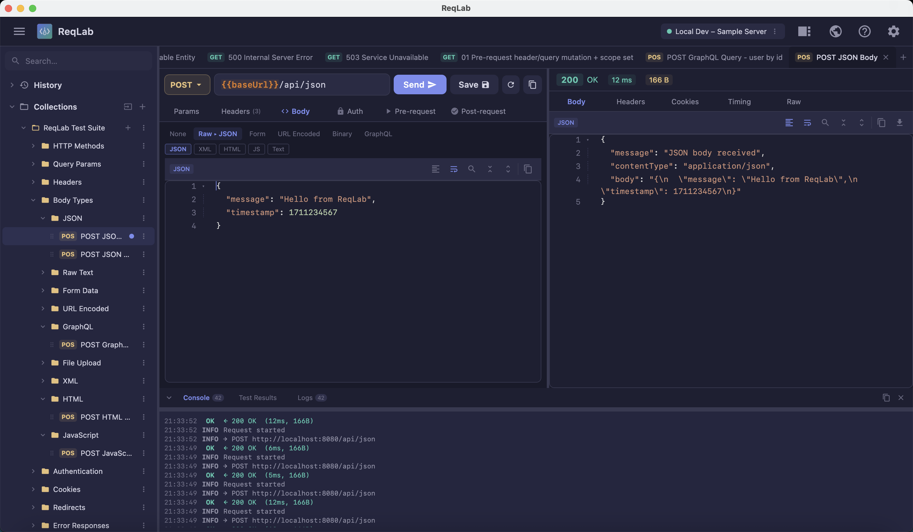
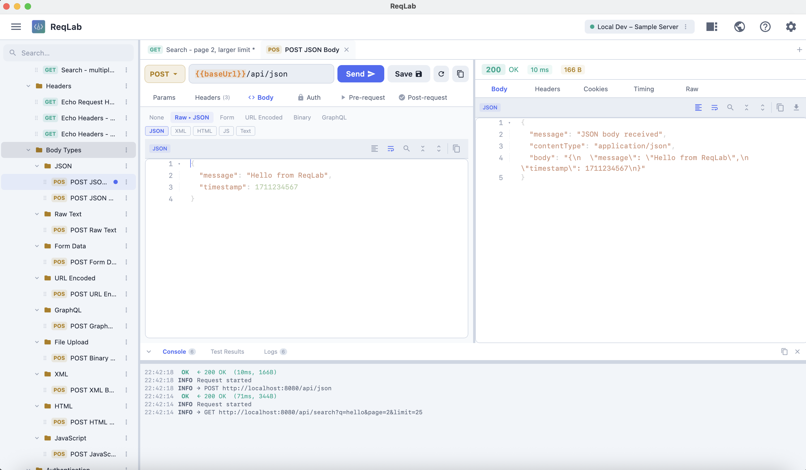
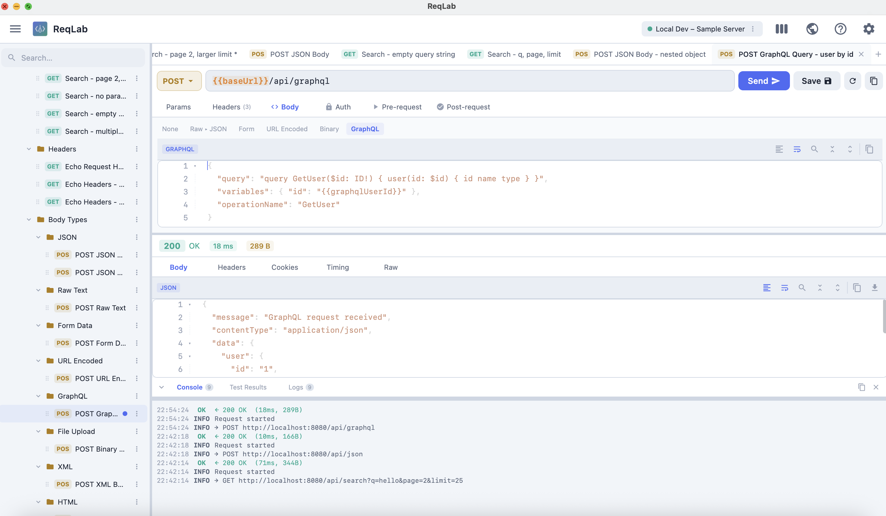

<p align="center">
  
</p>

<h1 align="center">ReqLab</h1>

<p align="center">
  <strong>A desktop-first API client built with Kotlin and Compose Multiplatform.</strong><br/>
  No accounts. No telemetry. No cloud lock-in. Just fast, scriptable HTTP.
</p>

[](LICENSE)
[]()
[](https://kotlinlang.org)
[](https://www.jetbrains.com/lp/compose-multiplatform/)
[](https://github.com/snj07/req-lab/actions)

---

<p align="center">
  
</p>

<p align="center">
  
  
</p>

---

## What is ReqLab?

ReqLab is a Kotlin + Compose Multiplatform API client for desktop (macOS, Linux, Windows) and web. It is designed for fast request iteration, scriptable validations, and reproducible API test workflows — running entirely offline with no accounts required.

## Quick Start

Requirements: JDK 17+ (JDK 21 recommended).

```bash
git clone https://github.com/snj07/req-lab.git
cd req-lab
./gradlew :ui-desktop:run
```

### macOS First Launch Note

Note for macOS users: If you see a warning that the app "cannot be opened because Apple cannot check it for malicious software":

- Right-click the app -> Open -> Open (bypasses the warning once), or
- Go to System Settings -> Privacy & Security -> "Open Anyway" (after attempting to open the app).

### Sample Files to Get Started

You can import these sample fixtures from the repo:

- Collection sample: [qa-tests/fixtures/reqlab-test-collection.json](qa-tests/fixtures/reqlab-test-collection.json)
- Environment sample: [qa-tests/fixtures/reqlab-test-environment.json](qa-tests/fixtures/reqlab-test-environment.json)

## Features

### 🚀 HTTP Requests

- Methods: `GET`, `POST`, `PUT`, `PATCH`, `DELETE`, `OPTIONS`, `HEAD`
- URL editing with live query-parameter table synchronisation
- Request headers editor (key/value table)
- Body types: JSON, GraphQL, form-data, x-www-form-urlencoded, raw text, binary
- Auth: None, Basic, Bearer Token, API Key, JWT
- Retry controls and per-request timeout
- Copy request as `curl`

### 📬 Response Inspection

- Status code, status text, and response headers
- Response body with syntax-highlighted viewer (JSON, XML, HTML, GraphQL, JS)
- Response timing (total, TTFB, DNS, TCP, TLS, body) and payload size
- Structured pass/fail test result reporting from post-request scripts

### ✏️ Code Editor

A full-featured Compose-native code editor — no WebView, no Electron.

- **Syntax highlighting**: JSON, XML/HTML, GraphQL, JavaScript
- **Code folding**: brace-based (`{ }`, `[ ]`), tag-based, comment-based; Fold All / Unfold All
- **In-editor search**: incremental match count, Previous/Next, keyboard-accessible
- **Auto-format**: JSON pretty-print, XML/HTML indentation
- Line numbers gutter, word wrap toggle, monospace font
- Virtualized rendering (no jank on responses over 10 MB)
- Full clipboard support (copy, cut, paste, select all) in both edit and read-only modes

### 📜 Scripting

JavaScript pre-request and post-request scripts through the `reqlab` namespace.

- **Pre-request**: mutate URL, headers, body, query params, and auth before dispatch
- **Post-request**: assert status, headers, timing, and body; persist extracted values
- Console logging via `reqlab.console.log(...)`

See the full guide: [docs/scripts.md](docs/scripts.md)

### 🌱 Variables

Four scopes, all interpolated as `{{variable}}` in URL, headers, body, and auth:

| Scope | API | Lifetime |
|---|---|---|
| Environment | `reqlab.environment.*` | Persisted with selected environment |
| Global | `reqlab.globals.*` | Persisted workspace-wide |
| Collection | `reqlab.collectionVariables.*` | Session-scoped runtime map |

### ✅ Assertions

Named test blocks with a rich assertion chain:

```javascript
reqlab.test("status is 200", () => {
    reqlab.expect(reqlab.response.status).to.equal(200);
});
```

Assertions: `equal`, `eql`, `include`, `match`, `above`, `below`, `at.least`, `at.most`, `lengthOf`, `property`, `oneOf`, `ok`, `true`, `false`, `null`, `not.*`, and more.

### 📁 Collections & History

- Unlimited collections with nested folders
- Multi-tab request workflow with tab reorder and persistence
- Request history with badge counts and sidebar sync
- Export and import as JSON (ReqLab-native or Postman format)

### 📥 Postman Import

> **⚠️ Experimental feature** — Postman collection and environment import, including automatic `pm.*` / `postman.*` script conversion, is experimental. While most common patterns are supported, complex or unsupported Postman APIs may not convert correctly and may require manual adjustments after import.

Import **Postman Collection v2 / v2.1** and **Postman Environment** files directly.

- All folders, requests, URLs, methods, headers, bodies, and auth types
- `pm.*` script calls are automatically rewritten to `reqlab.*` equivalents
- Legacy `postman.*` API calls (pre-v6) are also converted on import
- Disabled headers and variables are skipped; `pm.sendRequest` and `postman.setNextRequest` are commented out
- See [docs/scripts.md](docs/scripts.md#8-postman-migration-guide) for the full conversion reference

### ⌨️ Keyboard Shortcuts

| Shortcut | Action |
|---|---|
| `⌘ + Enter` / `Ctrl + Enter` | Send request (or cancel in-flight request) |
| `⌘ + Shift + [` / `Ctrl + Shift + [` | Move active tab left |
| `⌘ + Shift + ]` / `Ctrl + Shift + ]` | Move active tab right |
| `⌘ + S` / `Ctrl + S` | Save active request |
| `⌘ + W` / `Ctrl + W` | Close active tab |
| `⌘ + N` / `Ctrl + N` | New request tab |
| `⌘ + ,` / `Ctrl + ,` | Open Settings |

Full shortcut reference (including editor shortcuts): [docs/shortcuts.md](docs/shortcuts.md)

### ❓ In-App Help

Open from the toolbar `Help` icon or via **Settings → Open Help & About**:

- Feature overview and usage flow
- Keyboard shortcuts reference
- Scripting overview
- Version and build info

---

## Documentation

| Document | Description |
|---|---|
| [DEVELOPMENT.md](DEVELOPMENT.md) | Build, run, and contribute locally |
| [docs/architecture.md](docs/architecture.md) | Module structure and data flow |
| [docs/editor-architecture.md](docs/editor-architecture.md) | Code editor internals |
| [docs/scripts.md](docs/scripts.md) | Scripting API and variable scopes |
| [docs/shortcuts.md](docs/shortcuts.md) | Keyboard shortcut reference |
| [docs/testing.md](docs/testing.md) | Test strategy and coverage matrix |
| [docs/tests.md](docs/tests.md) | Test run commands |

---

## Contributing

Contributions are welcome. Please use [GitHub Flow](https://guides.github.com/introduction/flow): create a branch, add commits, and open a pull request.

For larger changes, open an issue first to align on approach and scope.

## Continuous Integration

ReqLab uses [GitHub Actions](https://github.com/features/actions) for CI. Push to `main` runs the quality gate; tags matching `v*` run the full build and publish a GitHub Release.

See the workflow: [`.github/workflows/release.yml`](https://github.com/snj07/req-lab/actions)

## License

Apache 2.0 — see [LICENSE](LICENSE).
